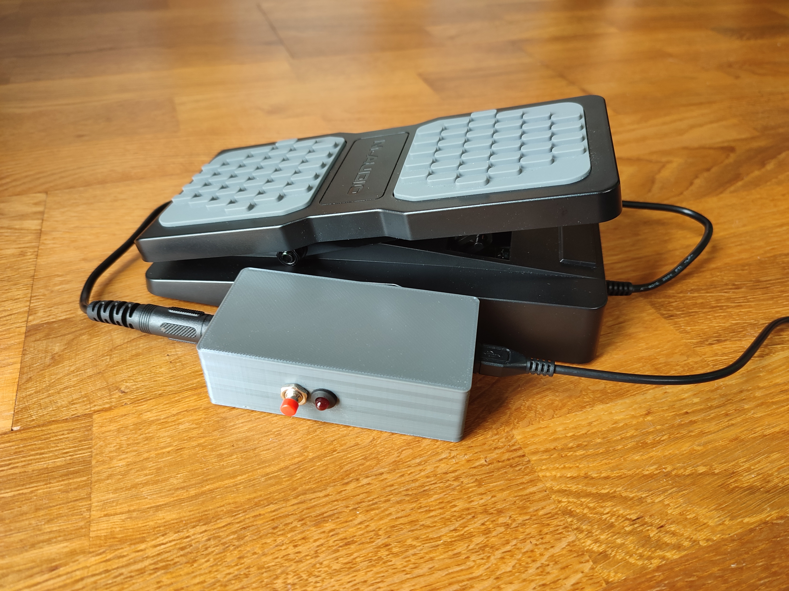
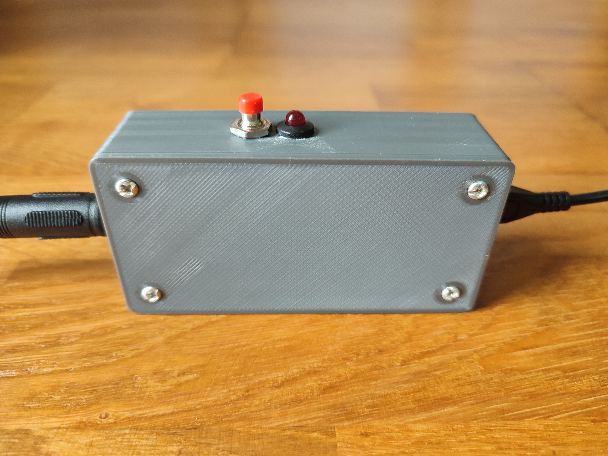
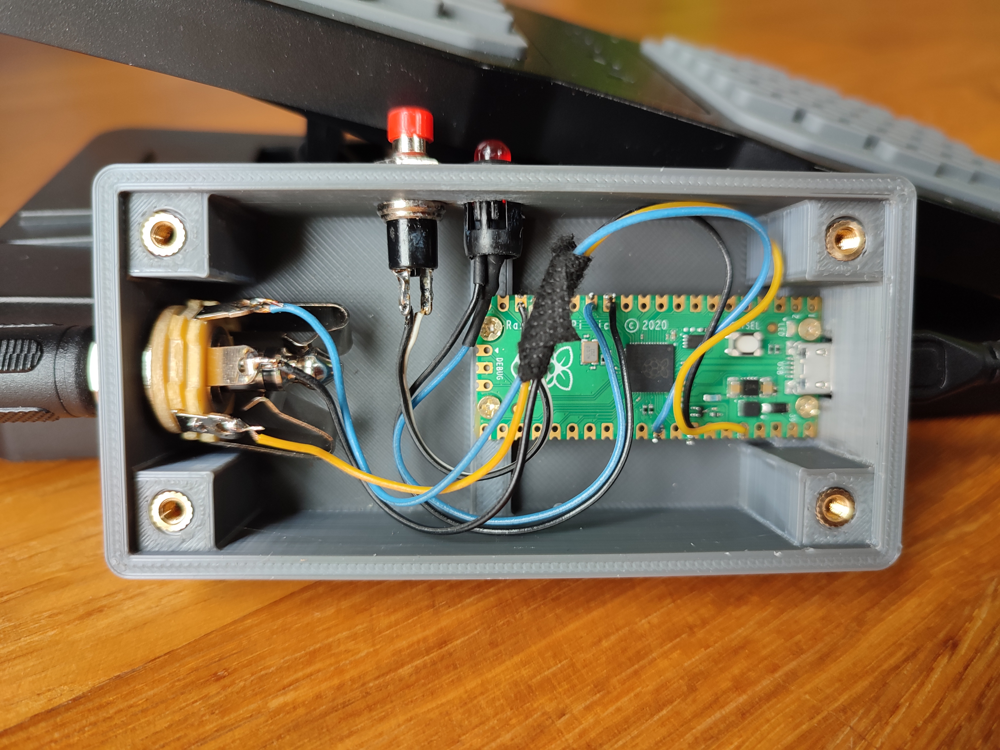
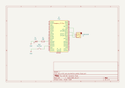

# Expression pedal to MIDI USB

A Raspberry Pi Pico-based device that takes an expression pedal output via a TRS 1/4" jack and converts it to a USB output.

# Instalation
Put your Raspberry Pi Pico into Bootsel mode by pressing the Bootsel button and then plug it into your computer. When the device appears as a mass storage device, simply drag and drop the UF2 file.

# Usage 
1. Connect the MIDI expression pedal to the 1/4" TRS stereo jack socket on the device.
2. Connect the device to your computer using a USB cable.
3. [Calibrate your device](#calibration)
4. Open your MIDI software on your computer (e.g., DAW) and configure it to receive data from the device.
5. Begin using the MIDI expression pedal, and the device will transmit the data to your computer.

# Calibration
1. Hold the button on the side of the device until the LED light starts flashing slowly.
2. Next, move your pedal from the minimum to the maximum position and set it approximately in the middle position.
3. Once you've completed step 2, press the button again. The LED will start flashing rapidly, indicating that the device is learning electrical noise values to prevent unintentional data transmission to the computer when you're not moving the pedal.
4. To finish the calibration process, press the button once more. The settings will be saved in the flash memory and will load automatically during the next device startup.

# Parts List:
- Raspberry Pi Pico
- 1/4" TRS stereo jack socket
- 5mm LED 
- [5mm LED Holder](https://www.amazon.com/50Pcs-Holder-Socket-Light-emitting-Plastic/dp/B07NRX2YNL/ref=sr_1_8?crid=20D28FTM71WXZ&keywords=led%2Bsocket%2B5mm&qid=1697561539&sprefix=led%2Bsocket%2B5mm%2Caps%2C231&sr=8-8&th=1)
- 330 Ohm resistor
- [7mm Momentary Push button Switch](https://www.aliexpress.com/item/32790920961.html)
- Some cables
- 4x M2 6mm screws
- 4x M3 Thread Knurled Brass Threaded Heat Set
- 4x M3 Head Bolt

# Schematic

